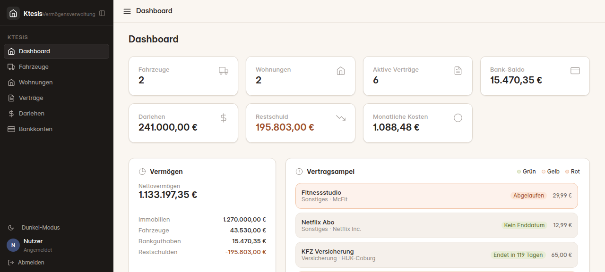
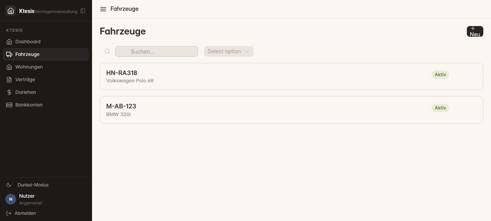
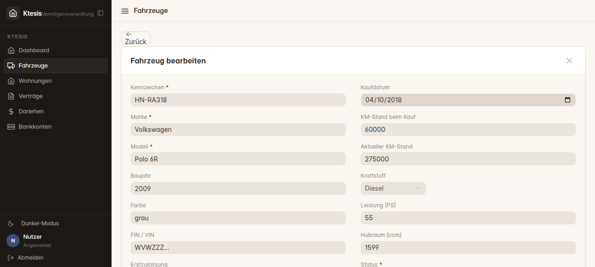

# Ktesis — Vermögensverwaltung

[](https://frappeframework.com/)
[](https://vuejs.org/)
[](https://tailwindcss.com/)
[](./license.txt)

**Ktesis** ist eine private Vermögensverwaltung als Single-Page Application, gebaut auf dem Frappe Framework. Fahrzeuge, Immobilien, Verträge, Darlehen und Bankkonten — übersichtlich in einer App.

---

## Screenshots

| Dashboard | Liste | Detail |
|-----------|-------|--------|
|  |  |  |

---

> **Development Stage** — Ktesis ist eine persönliche Vermögensverwaltung in aktiver Entwicklung.
> Nicht für Produktionsumgebungen mit sensiblen Fremddaten geeignet.

## Features

- **Dashboard** — KPI-Karten: Nettovermögen, Bankkonten, Darlehensrestschuld, monatliche Kosten
- **Vertragsampel** — Rot/Gelb/Grün nach Restlaufzeit (< 30 / < 90 / > 90 Tage)
- **Fahrzeuge** — Kennzeichen, Marke, Modell, KM-Stand, Kaufpreis, Fahrzeugbild
- **Wohnungen** — Immobilienwerte, Abschreibungen, Status (bewohnt/vermietet/leerstehend)
- **Verträge** — Versicherung, Miete, Wartung mit Kündigungsfrist-Tracking
- **Darlehen** — Tilgungsplan-Berechnung, Restschuld, Zinsbindung
- **Bankkonten** — Kontostände (manuell + FinTS-fähig), Buchungshistorie
- **Anhänge** — Datei-Upload zu jedem Dokument
- **Dark Mode** — Umschaltbar über die Sidebar
- **HTTPS-Setup** *(experimentell)* — Self-signed SSL für lokalen Betrieb per Bench-Command

---

## Technologien

| Layer | Technologie |
|-------|-------------|
| Backend | Frappe Framework 15+ (Python) |
| Frontend | Vue 3 + Vite |
| Styling | Tailwind CSS + frappe-ui Semantic Colors |
| UI-Komponenten | frappe-ui (Button, FormControl, Dialog, FileUploader, Badge) |
| Router | Custom Hash-Router |

---

## Installation

### Voraussetzungen

- Frappe Bench (Version 15+)
- Node.js 18+

### 1. App holen und installieren

```bash
bench get-app https://github.com/ManuelDell/ktesis.git
bench --site <deine-site> install-app ktesis
bench --site <deine-site> migrate
```

### 2. Frontend bauen

```bash
cd apps/ktesis/frontend
npm install
npm run build
```

### 3. Frappe neu starten

```bash
bench restart
```

### 4. App öffnen

Das Ktesis-Icon erscheint auf dem Frappe Desk. Falls nicht:

```bash
bench --site <deine-site> clear-cache
```

Direkt erreichbar unter: `http://<deine-site>/ktesis`

---

## HTTPS einrichten *(experimentell)*

> **⚠ Development Stage** — Diese Funktion ist experimentell und nicht für Produktionsumgebungen
> mit sensiblen Fremddaten geeignet. Self-signed Zertifikate bieten keine CA-Vertrauenskette;
> Browser zeigen eine Zertifikatswarnung, die manuell bestätigt werden muss.

Ktesis bringt einen Bench-Command mit, der automatisch:

1. Ein self-signed RSA-4096-Zertifikat mit IP-SAN generiert (kein Domain-Name nötig)
2. Eine nginx-Konfiguration nach `/etc/nginx/conf.d/ktesis-https.conf` schreibt
3. `force_https` in der Site-Config aktiviert (alle Routen auf HTTPS)
4. nginx validiert und neu lädt

### Voraussetzungen

- nginx installiert und aktiv
- Root-Rechte (schreibt in `/etc/ssl/ktesis/` und `/etc/nginx/conf.d/`)
- OpenSSL verfügbar

### Ausführen

```bash
sudo bench setup-ktesis-https --site <deine-site>
```

Mit optionalen Parametern:

```bash
sudo bench setup-ktesis-https \
  --site mysite.localhost \
  --ip 192.168.1.100 \         # Standard: automatisch erkannt
  --gunicorn-port 8000 \       # Standard: 8000
  --socketio-port 9000 \       # Standard: 9000
  --cert-dir /etc/ssl/ktesis \ # Standard: /etc/ssl/ktesis
  --skip-nginx-reload          # nginx nicht automatisch neu laden
```

### Ergebnis

Nach dem Command:

- Ktesis erreichbar unter `https://<IP>/ktesis`
- Frappe Desk erreichbar unter `https://<IP>/app`
- Zertifikatswarnung im Browser **einmalig** bestätigen

### Zertifikat erneuern

```bash
# Altes Zertifikat löschen und Command erneut ausführen
sudo rm /etc/ssl/ktesis/server.{crt,key}
sudo bench setup-ktesis-https --site <deine-site>
```

### Bekannte Einschränkungen

- **Self-signed:** Browser zeigen Zertifikatswarnung — kein Let's Encrypt, keine CA
- **IP-gebunden:** Zertifikat gilt für eine feste IP; bei IP-Wechsel neu generieren
- **Keine Bench-Integration:** `bench setup nginx` überschreibt die Frappe-Config nicht, aber bei manuellem `bench setup nginx`-Aufruf die ktesis-nginx-Config separat prüfen
- **Kein automatisches Renewal:** Zertifikat läuft nach 10 Jahren ab (kein Cronjob)
- **Development only:** Für öffentliche Server Let's Encrypt + Domain verwenden

---

## Architektur

```
ktesis/
├── ktesis/                      # Python-Paket
│   ├── api/                     # Whitelisted API-Endpunkte
│   │   ├── __init__.py          # get_dashboard_stats
│   │   ├── dashboard.py         # Vermögensentwicklung, Finanzübersicht, Ampel
│   │   ├── fahrzeug.py          # CRUD Fahrzeug
│   │   ├── wohnung.py           # CRUD Wohnung + Abschreibungen
│   │   ├── vertrag.py           # CRUD Vertrag
│   │   ├── darlehen.py          # CRUD Darlehen + Tilgungsplan
│   │   ├── bankkonto.py         # CRUD Bankkonto + Buchungen
│   │   └── attachments.py       # Datei-Anhänge
│   ├── ktesis/                  # Frappe-Modul "Ktesis"
│   │   └── doctype/             # DocType-Definitionen
│   │       ├── fahrzeug/
│   │       ├── wohnung/
│   │       ├── vertrag/
│   │       ├── darlehen/
│   │       ├── bankkonto/
│   │       ├── bankbuchung/
│   │       └── abschreibung/
│   ├── commands.py              # Bench CLI: setup-ktesis-https (experimentell)
│   ├── install.py               # after_install Hook
│   ├── hooks.py                 # App-Konfiguration
│   ├── permissions.py           # Zugriffsregeln
│   └── www/ktesis.py            # SPA-Einstiegspunkt + Guest-Redirect
│
├── frontend/                    # Vue 3 SPA
│   └── src/
│       ├── views/               # Dashboard, Fahrzeuge, Wohnungen, ...
│       ├── components/          # Detail-Formulare, KachelCard, AttachmentList
│       ├── composables/
│       │   └── useApi.js        # Frappe REST API Wrapper
│       ├── router.js            # Hash-Router
│       └── App.vue              # Layout mit Sidebar
│
└── docs/screenshots/
```

---

## API-Übersicht

### Dashboard

| Endpunkt | Beschreibung |
|----------|--------------|
| `ktesis.api.get_dashboard_stats` | KPI-Zahlen (Counts, Salden) |
| `ktesis.api.dashboard.get_finance_summary` | Bankkonten, Darlehen, Vertragskosten |
| `ktesis.api.dashboard.get_vertrags_ampel` | Verträge mit Ampel-Status |
| `ktesis.api.dashboard.get_vermoegensentwicklung` | Nettovermögen-Berechnung |

### CRUD

| DocType | Endpunkte |
|---------|-----------|
| Fahrzeug | `get_vehicles` · `create_vehicle` · `update_vehicle` · `delete_vehicle` |
| Wohnung | `get_properties` · `create_property` · `update_property` · `delete_property` |
| Vertrag | `get_contracts` · `create_contract` · `update_contract` · `delete_contract` |
| Darlehen | `get_loans` · `create_loan` · `update_loan` · `delete_loan` · `calculate_amortization_schedule` |
| Bankkonto | `get_bank_accounts` · `create_bank_account` · `update_bank_account` · `delete_bank_account` |

---

## Roadmap

- [x] **Phase 1** — Design-Fundament (frappe-ui Semantic Colors, SPA-Layout)
- [x] **Phase 1.x** — FinTS-Sicherheitsfixes (PIN-Queue, HTTPS-Validierung, Job-Eigentümer)
- [x] **Phase 1.x** — HTTPS-Setup-Command `bench setup-ktesis-https` *(experimentell)*
- [ ] **Phase 2** — Dashboard-Upgrade (Charts, Budget-Planung, PDF-Export)
- [ ] **Phase 3** — Verträge 2.0 (Kündigungsassistent, Dokumenten-Safe)
- [ ] **Phase 4** — Erweiterte Module (Investitionen, Altersvorsorge, Steuern)
- [ ] **Phase 5** — KI & Automatisierung (Ollama, Dokumenten-Parser, Telegram-Bot)

---

## Entwicklung

### Frontend live (mit HMR)

```bash
cd apps/ktesis/frontend
npm run dev
```

### Python-API testen

```bash
echo "from ktesis.api import get_dashboard_stats; print(get_dashboard_stats())" \
  | bench --site development console
```

---

## Lizenz

MIT — siehe [license.txt](./license.txt)
