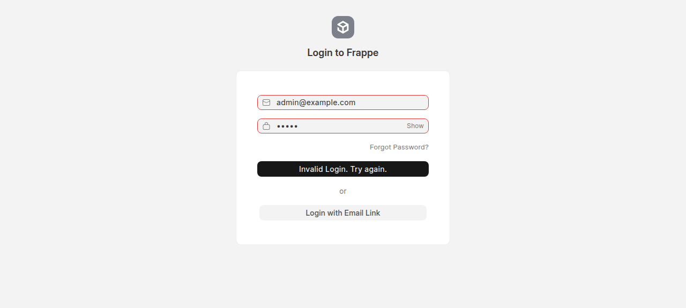
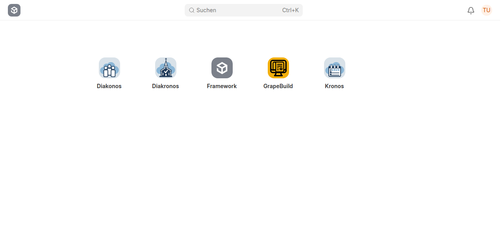

# Ktesis — Vermögensverwaltung

[](https://frappeframework.com/)
[](https://vuejs.org/)
[](https://tailwindcss.com/)

**Ktesis** ist eine moderne, als Single-Page Application (SPA) gebaute Vermögensverwaltung für Frappe. Sie vereint Fahrzeuge, Immobilien, Verträge, Darlehen und Bankkonten in einer übersichtlichen Oberfläche.

---

## Features

- **Dashboard** mit KPI-Karten (Vermögen, Vertragsampel, Bankkonten, Darlehen)
- **Fahrzeuge** — Kennzeichen, Marke, Modell, KM-Stand, Wartungshistorie
- **Wohnungen/Immobilien** — Bewohnt, Vermietet, Leerstehend, Abschreibungen
- **Verträge** — Versicherung, Miete, Wartung, Sonstiges mit Kündigungsampel
- **Darlehen** — Tilgungsplan, Restschuld, Zinssatz
- **Bankkonten** — Kontostände, Buchungen (Eingang/Ausgang)
- **Anhänge** — Datei-Upload zu jedem Dokument
- **Dark Mode** — Umschaltbar über die Sidebar
- **Frappe-UI** — Nutzt offizielle frappe-ui Komponenten (FormControl, Dialog, FileUploader, Badge)

---

## Screenshots

### Login & Frappe Desk
Gäste werden automatisch zum Login weitergeleitet. Nach dem Login landet der Nutzer auf dem Frappe Desk und kann Ktesis über das App-Icon starten.




### Dashboard
Übersicht über Vermögen, Vertragsampel, Bankkonten und Darlehen.


### Listen-Ansicht
Einheitliche Listen mit Suche, Filter und Aktionen pro Zeile.


### Detail-Ansicht
Formular mit `FormControl`-Feldern, Datei-Upload und Anhangsliste.


---

## Architektur

```
ktesis/
├── ktesis/                  # Python Backend
│   ├── api/                 # Whitelisted API-Methoden
│   │   ├── __init__.py      # Dashboard-Stats
│   │   ├── dashboard.py     # Finance Summary, Ampel, Vermögen
│   │   ├── fahrzeug.py      # CRUD Fahrzeug
│   │   ├── wohnung.py       # CRUD Wohnung
│   │   ├── vertrag.py       # CRUD Vertrag
│   │   ├── darlehen.py      # CRUD Darlehen + Tilgungsplan
│   │   ├── bankkonto.py     # CRUD Bankkonto + Buchungen
│   │   └── attachments.py   # Datei-Anhänge
│   ├── auth.py              # Guest-Redirect
│   ├── hooks.py             # App-Konfiguration
│   └── www/ktesis.py        # SPA-Seiten-Context
│
├── frontend/                # Vue 3 SPA
│   ├── src/
│   │   ├── views/           # Seiten (Dashboard, Fahrzeuge, ...)
│   │   ├── components/      # Detail-Formulare + AttachmentList
│   │   ├── composables/
│   │   │   └── useApi.js    # Frappe REST API Wrapper
│   │   ├── router.js        # Hash-based Router
│   │   └── App.vue          # Layout mit Sidebar
│   ├── index.html
│   └── vite.config.js       # frappe-ui Build-Plugin
│
└── docs/screenshots/        # Dokumentations-Bilder
```

---

## Technologien

| Layer | Technologie |
|-------|-------------|
| Backend | Frappe Framework 15+ (Python) |
| Frontend | Vue 3 + Vite |
| Styling | Tailwind CSS + frappe-ui Semantic Colors |
| UI-Komponenten | frappe-ui (Button, FormControl, Dialog, FileUploader, Select, Input, Badge) |
| Icons | Feather Icons (via frappe-ui) |
| Router | Custom Hash-Router (kein Vue Router) |

---

## Installation

### 1. Frappe-App installieren

```bash
bench get-app https://github.com/ManuelDell/ktesis.git
bench --site your-site install-app ktesis
bench --site your-site migrate
```

### 2. Frontend bauen

```bash
cd apps/ktesis/frontend
npm install
npm run build
```

### 3. Frappe neu starten

```bash
bench restart
# oder bei Supervisor:
supervisorctl restart all
```

### 4. Desk-Icon (optional)

Falls das Ktesis-Icon nicht im Frappe Desk erscheint:

```bash
bench --site your-site clear-cache
```

---

## API-Endpunkte

### Dashboard

| Methode | Endpunkt | Beschreibung |
|---------|----------|--------------|
| GET | `ktesis.api.get_dashboard_stats` | KPI-Zahlen für Dashboard |
| GET | `ktesis.api.dashboard.get_finance_summary` | Bankkonten, Darlehen, Kosten |
| GET | `ktesis.api.dashboard.get_vertrags_ampel` | Verträge mit Ampel-Status |
| GET | `ktesis.api.dashboard.get_vermoegensentwicklung` | Nettovermögen |

### CRUD (pro DocType)

| DocType | List | Detail | Create | Update | Delete |
|---------|------|--------|--------|--------|--------|
| Fahrzeug | `ktesis.api.fahrzeug.get_vehicles` | `?name=...` | `create_vehicle` | `update_vehicle` | `delete_vehicle` |
| Wohnung | `ktesis.api.wohnung.get_properties` | `?name=...` | `create_property` | `update_property` | `delete_property` |
| Vertrag | `ktesis.api.vertrag.get_contracts` | `?name=...` | `create_contract` | `update_contract` | `delete_contract` |
| Darlehen | `ktesis.api.darlehen.get_loans` | `?name=...` | `create_loan` | `update_loan` | `delete_loan` |
| Bankkonto | `ktesis.api.bankkonto.get_bank_accounts` | `?name=...` | `create_bank_account` | `update_bank_account` | `delete_bank_account` |

> **Hinweis:** Das Frontend nutzt primär die native Frappe REST API (`/api/resource/DocType`) für Listen und CRUD. Die Custom-APIs dienen dem Dashboard und speziellen Operationen (Tilgungsplan, Buchungen, Anhänge).

---

## Bekannte Einschränkungen

- **Buchungen:** Der DocType `Bankbuchung` wird von der API erwartet, ist aber noch nicht angelegt. Die Bankkonto-Detailseite zeigt daher keine Buchungshistorie.
- **Alte API-Datei:** `ktesis/api.py` ist redundant zu `ktesis/api/__init__.py` und `ktesis/api/dashboard.py`. Sie sollte entfernt werden.

---

## Entwicklung

### Frontend live bauen

```bash
cd apps/ktesis/frontend
npm run dev
```

### Python-Konsole testen

```bash
cd frappe-bench
echo "from ktesis.api import get_dashboard_stats; print(get_dashboard_stats())" | bench --site development console
```

---

## Lizenz

MIT
